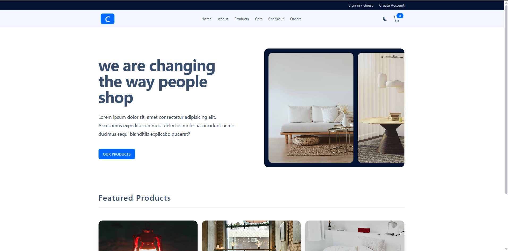
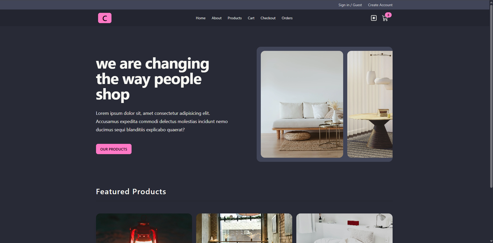

# Comfy Store

Bu mening React loyiham.
# Comfy Store



> **Comfy Store** — zamonaviy, responsiv va foydalanuvchi uchun qulay online do‘kon frontend loyihasi.  
> React va Tailwind CSS yordamida yaratilgan.

---

## 📖 Loyiha haqida

Comfy Store — mijozlarga qulay mahsulotlarni ko‘rish, tanlash va xarid qilish imkonini beruvchi onlayn do‘kon.  
Loyiha asosan quyidagi texnologiyalar asosida ishlab chiqilgan:

- React-Vite
- Tailwind CSS
- React Router
- Redux 
- Axios (API so‘rovlar uchun)
- Tanstack Query

---
## 🚀 Loyihani ishga tushirish bo‘yicha ko‘rsatmalar

Quyidagi bosqichlarni bajaring:
1. Loyihani GitHub’dan klonlash:
```bash
git clone https://github.com/SardorbekCoder07/Comfy-Store.git

## 🚀 Loyihani ishga tushirish

Quyidagi buyruqlarni terminalda ketma-ket bajarish orqali loyihani mahalliy kompyuteringizda ishga tushirishingiz mumkin:

```bash
git clone https://github.com/SardorbekCoder07/Comfy-Store.git
cd Comfy-Store
npm install       # yoki yarn install
npm run dev         # yoki yarn start


Mana shunday qilib barchasini to‘liq va ixcham qilib yozib qo‘ydim. Yana yordam kerak bo‘lsa, bemalol yozing!
